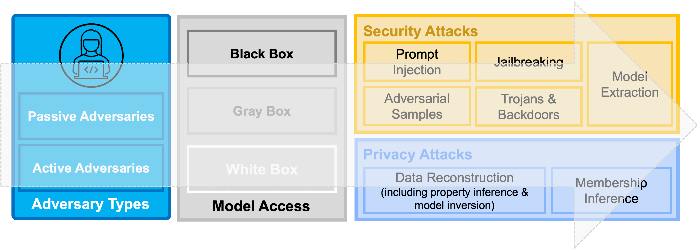

# LLM Security and Privacy

A curated list of papers and tools covering [LLM threats](https://github.com/topics/llm-threats) and [vulnerabilities](https://github.com/topics/llm-vulnerabilities), both from a [security](https://github.com/topics/llm-security) and [privacy](https://github.com/topics/llm-privacy) standpoint. Summaries, key takeaway points, and additional details for each paper are found in the [paper-summaries](./paper-summaries) folder. 

[main.bib](./main.bib) file contains the latest citations of the papers listed here.

  
  <b>Overview Figure:</b> A taxonomy of current security and privacy threats against deep learning models and consecutively Large Language Models (LLMs).

## Papers

1. An Overview of Catastrophic AI Risks [PDF](https://arxiv.org/pdf/2306.12001.pdf)
2. Use of LLMs for Illicit Purposes: Threats, Prevention Measures, and Vulnerabilities [PDF](https://arxiv.org/pdf/2308.12833.pdf)
3. LLM Censorship: A Machine Learning Challenge or a Computer Security Problem? [PDF](https://arxiv.org/pdf/2307.10719.pdf)
4. Beyond the Safeguards: Exploring the Security Risks of ChatGPT [PDF](https://arxiv.org/pdf/2305.08005.pdf)
5. Prompt Injection attack against LLM-integrated Applications [PDF](https://arxiv.org/pdf/2306.05499.pdf)
6. Identifying and Mitigating the Security Risks of Generative AI [PDF](https://arxiv.org/pdf/2308.14840.pdf)

## Tools

## Contributing

If you are interested in contributing to this repository, please see [CONTRIBUTING.md](./CONTRIBUTING.md) for details on the guidelines.

A list of current contributors is found [HERE](./contributors.md).

## Contact

For any questions regarding this repository and/or potential (research) collaborations please contact [Briland Hitaj](mailto:briland.hitaj@sri.com).
